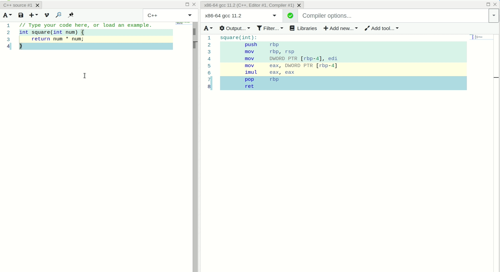

# Adding Assembly Documentation for a new instruction set

This document explains how to add assembly documentation for a new instruction set to Compiler Explorer
("CE" from here on).

If you were not already aware, CE has both quick-tip and more thorough assembly instruction documentation available for
a couple instruction sets (currently JVM bytecode, amd64 and arm32). The feature is demonstrated in the gif below.



To add a new assembly documentation handler, you need to perform the following steps:

## 1. Find a data source

First you need to find a data source to get our instruction info from. While it is possible to write down
information about every single instruction for an instruction set, it's far from maintainable, and it is a lot of work.

Existing assembly documentation handlers use some sort of established documentation. The arm32 handler uses the
developer.arm.com website and the JVM bytecode handler uses Oracle's documentation.

## 2. Create a tool for collecting the data

Since we want to go through the automated route, you should write a script or a piece of code to automatically gather
the data for us and store it in a nice format that CE expects. The output of the script should be a generated .js file
with a single exported function containing a gigantic switch for the instruction opcode. Examples of this generated file
can be found in `/lib/asm-docs/generated/asm-docs-amd64.js`.

How you generate this file is completely up to you, just make sure it's easy for others to run the script if needed as
well. If you need inspiration on how to write this tool, you can look at the `docenizer-*` scripts found in
`/etc/scripts/docenizers` in the source control tree.

CE expects the tool to output the file into the `/lib/asm-docs/generated/` folder with a name following the existing 
convention. Each case in the switch should return a piece of formatted HTML to insert into the popup, a tooltip text 
for the on-hover tooltip and a URL to external documentation.

```js
case "CALL":
    return {
        "html": "[html to embed into the popup]",
        "tooltip": "[text to show in the hover tooltip]",
        "url": "http://www.felixcloutier.com/x86/CALL.html"
    };
```

## 3. Connect your tool output to CE

Once your tool has generated the JavaScript file, you want to connect it to CE. This is done by editing the files found
in the `/lib/asm-docs` directory which is adjacent to your newly generated JavaScript file.

First you want to add a new file named after your instruction set which exports a class extending the
`BaseAssemblyDocumentationProvider` class. The class should implement the `getInstructionInformation` method which
in most cases, delegates to your generated JavaScript. Instruction sets like Arm32 have use code to tweak the output
if needed.

This method is expected to take the instruction opcode in full uppercase and either return the associated data or null
if not found.

```ts
import { getAsmOpcode } from './generated//asm-docs-java';
import { BaseAssemblyDocumentationProvider } from './base';

export class JavaDocumentationProvider extends BaseAssemblyDocumentationProvider {
    // Return the instruction set name
    public static get key() { return 'java'; }
    public override getInstructionInformation(instruction: string): AssemblyInstructionInfo | null {
        return getAsmOpcode(instruction) || null;
    }
}
```

Finally we want to tell CE that the new documentation provider exists. This is done by re-exporting the class inside
`/lib/asm-docs/_all.ts`. Please keep the exports here in alphabetic order.
## 4. Testing

Testing new assembly documentation providers is really easy. It is just a matter of modifying the `TEST_MATRIX` variable
found in the `/test/handlers/asm-docs-tests.js` file.
