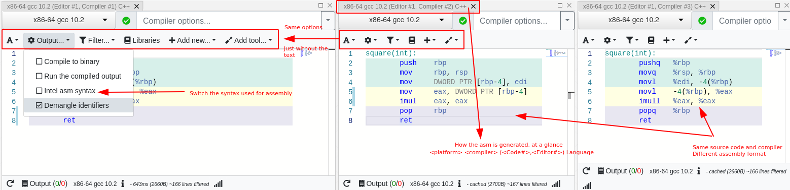
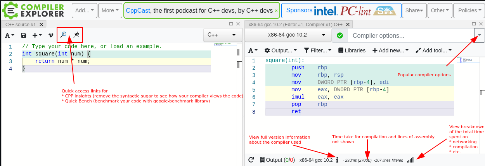
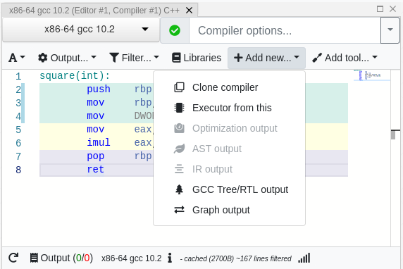
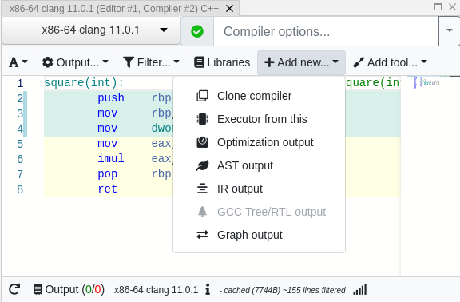

# How do I ?

This is a how-to guide for the user-interface presented by [Compiler Explorer](https://godbolt.org). This doesn't cover
the details of how to set up or modify Compiler Explorer for your own needs. For that, please check the documents which
already cover topics like:

- [Adding a language](AddingALanguage.md)
- [Adding a compiler](AddingACompiler.md)
- [Adding a library](AddingALibrary.md)
- [Adding a tool](AddingATool.md)
- and many more at [compiler-explorer/docs](https://github.com/compiler-explorer/compiler-explorer/tree/main/docs)

Fast links:

- [How do I ?](#how-do-i-)
  - [Change the assembly syntax from Intel](#change-the-assembly-syntax-from-intel)
  - [Compare the time taken by compilation and networking](#compare-the-time-taken-by-compilation-and-networking)
  - [View intermediate information provided by the compilers](#view-intermediate-information-provided-by-the-compilers)

## Change the assembly syntax from Intel

The option to switch assembly from Intel to AT&T syntax is present in the `Output` option of each compiler. If enough
space is not present, the option also presents itself as the gear symbol (⚙)

## Compare the time taken by compilation and networking

This is the symbol that looks like a bar graph (📊). If your compilations are taking long, you can use this to check the
time taken by:

- Networking, JavaScript, waiting for events, etc.
- Checking the cache and retrieving from it on a cache-hit
- Compilation (on force compilation or cache-miss)
- Parsing the generated assembly before presenting it

## View intermediate information provided by the compilers

 

Though both GCC and Clang create supplementary outputs along with assembly (shown by default), and an executable
(created if an executor has been added), the exact nature of the outputs and their formats differ between the compilers.

GCC allows the Tree, IPA, RTL and graph outputs, while Clang allows optimization, AST, IR and graph outputs. Some
outputs (e.g. RTL or graph) also have a rich set of options in the UI to enable focussing on a particular function or
compiler stage.
