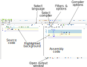
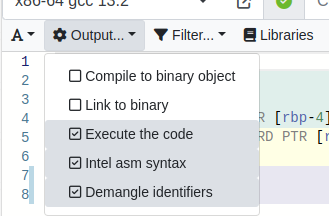
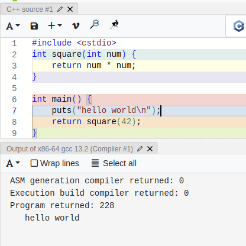
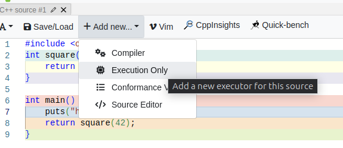
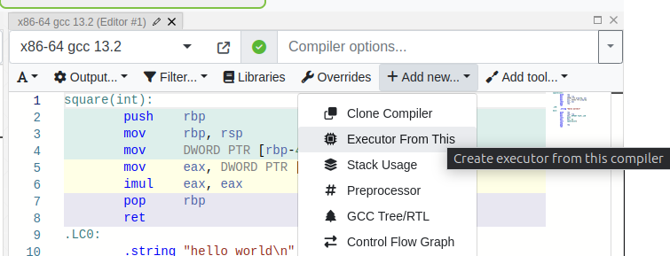

# New to Compiler Explorer?

Compiler Explorer lets you see how a compiler sees your code. In its default view it will show you the assembly output
of your compiler. You can also see the execution of the code but [more about that later](#Execution).

## Background: Compilers Create Assembly

_Compilers_ are programs which take the source of a program and convert it into the _machine code_ a processor runs. The
machine code is very specific to the kind of CPU in the computer and is a series of numbers representing the steps the
machine has to perform.

For example a machine code program to add two numbers together, with 32-bit inputs specified in CPU _registers_ `edi`
and `esi`, and result left in `eax`:

```
01fe89f0c3
```

Machine code may be what the computer needs, it is not a convenient representation for humans. Instead, _assembly_ is
commonly used, a (somewhat readable) text representation of the machine code. The encoding is bidirectional: humans can
write assembly and have it encoded as machine code with a program called an _assembler_, and machine code can be turned
into assembly with a _disassembler_.

The same code as above in machine code is (arguably!) a little easier to comprehend:

```nasm
add esi, edi        ; corresponds to the bytes 01 fe
mov eax, esi        ; corresponds to the bytes 89 f0
ret                 ; corresponds to the byte  c3
```

Assembly is easier to understand but is still more lower-level and complex than most programmers want to deal with, full
of very CPU-specific information. In a higher level language like C you would probably have written this code as:

```c
int add(int x, int y) {
  return x + y;
}
```

A compiler turns this source into machine code (for example, GCC). The compiler parses and understands the C language,
turning the programmer's intention into the nitty-gritties of the target CPU's machine code. Compilers can also also
perform _optimizations_ which can significantly improve the code performance over a naive transliteration.

For example, passing GCC the C source above and asking it to optimize produces the following machine code/assembly:

```nasm
lea    eax,[rdi+rsi*1]  ; corresponds to machine code bytes 8d 04 37
ret                     ; corresponds to machine code byte c3
```

In this case GCC has been able to use a different machine code instruction (`lea`) to perform the add instead of `edi`
and `esi` _and_ put the result directly into the `eax` register. This has saved one byte of program space as well as one
instruction of execution.

## What is Compiler Explorer?

As programming languages get more complex, and compilers and their optimizers become more sophisticated, it can be
useful to understand what actual machine code is generated. Compiler Explorer lets you explore the capabilities of your
language, compiler and optimizer in an interactive way.

The default view of Compiler Explorer shows an editor window on the left, with a very simple demonstrative example
program, and the assembly output of the compiler on the right. By default, Compiler Explorer will show a C++ program,
but you can pick the language from the language selection drop-down at the top right of the editor.



The compilation output appears immediately, and will update as you edit the code. Each line is highlighted with a
different colour, and as best as we can track it the resulting assembly code corresponding to that line of source code
is highlighted with the same colour. Mousing over a line in either the source or the assembly will briefly highlight the
corresponding line in the other window too. Hovering over an assembly opcode will give an overview of what that
instruction does, and more information is available by right-clicking and selecting "View assembly documentation".

By default, the compiler is run with no optimization enabled, so the output is often long. Compilers will generate very
verbose, naive code without any optimization. To enable optimization, and change other aspects of the compilation, you
will need to change the command-line arguments passed to the compiler. To do so, add the flags in the input box at the
top right of the compiler output window. If you are using C++, commonly the optimizer can be enabled with `-O` followed
by an optimization level (0-3), so `-O1` is minimal optimization, and `-O3` is aggressive optimization.

Compiler Explorer supports many different compilers. The drop-down on the top left of the compiler window lets you
select a different compiler. You can favourite the compilers you use the most by clicking the yellow star, and you can
pop out a whole compiler selection dialog by choosing either the "Pop out" button or clicking the icon at the right of
the selection panel.

Sometimes you'll need to see the compiler's diagnostic messages (though Compiler Explorer tries to parse and highlight
relevant parts of the output in the editor window). To view the compiler's output you can bring up the output pane by
clicking or dragging the "Output" button at the bottom of the compiler window. Note that all the panes within the site
can be resized, rearranged and stacked by dragging the relevant parts of the UI.

There are many options in the compiler's output that can be changed by changing the options available on the various
drop-downs on the compiler view, including the intelligent filtering Compiler Explorer applies to the compiler's output,
and also changing whether we try to link and execute the resulting code.

## Execution

Compiler Explorer allows you to edit your code and see what it outputs, once compiled. There are two ways to do this:

1. In the default "assembly" view, tick the "Execute the code" option in the compiler options. This will then show the
   assembly output, and the program output will be displayed in the output window (where the compiler errors etc would
   be shown).
2. The "Execute only" view doesn't show any assembly and lets you just see the output of your program. This also has the
   benefit of letting you pass command-line arguments and standard input to your program

### Using the assembly view

To use the first approach, click the "Options" dropdown on the assembly window, then tick the "Execute the code":



The program status and output will appear in the compiler output window, which can be opened by clicking or dragging the
"Output" button at the bottom of the assembly view:



### Using an "Execute only" view

Compiler Explorer supports a view that only executes the code you're editing. There are two ways to create such a view:

- From the source code view, click "Add new..." on the source code view and click or drag "Execution Only".



- From the assembly view, click "Add new..." on the assembly view and click or drag "Executor From This". This approach
  will clone all the compiler settings and options from the compiled assembly view.



In both cases, once created, the Execute Only view can be used to pick and choose compilers and compiler arguments just
like the assembly view; but additionally you can add command-line options and standard input to your program. Each
assembly or execution view is separate from the others; you can close the assembly view if you're not interested in its
output.

## General UI

You can click and drag each pane around to rearrange and resize it. You can also maximise a pane to make it take up the
whole page, or close it, with the two buttons at the top right.

Assembly views support extra child panes, and support tooling.

Child panes can be created with the "Add new..." button and include views that are compiler-specific. For example, for
`clang`-based compilers we can supply additional command-line options to the compiler to emit optimization information,
and then display it with the "Opt Pipeline" pane. There are similar panes for the `gcc`-based compilers. Some
panes, like the "Control Flow Graph" work on most compilers.

Tool windows include separate binary tools that run over the result of compilation, independent of the compiler. For
example, we can run the UNIX command `strings` over the compilation result to show all the strings in the binary. To add
a tool, use the "Add tool..." button on the assembly view.

Compiler Explorer supports integrating with some sister sites: CPP Insights, and Quick-Bench. We also emit a number of
other metrics about the compilation, accessible from the bottom of the assembly window:


## More information

This introduction covers only a few of Compiler Explorer's features. For more information please join our
[welcoming Discord](https://discord.gg/B5WacA7) and feel free to ask questions there. There is also a more in-depth
description in this [two-part video series on YouTube](https://www.youtube.com/watch?v=4_HL3PH4wDg), though the
interface changes over time.
