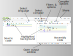

# What is Compiler Explorer?

This document is a general overview of the why, what and how of Compiler Explorer. The site lets you see how a compiler
sees your code. In its default view it will show you the assembly output of your compiler. If you are only interested in
running a program and seeing its output, skip to the section on "Execution" below.

## Interacting with the assembly output of a compiler

If you're familiar with compilers you may wish to skip the background. Else, read on!

### Background

Many programming languages are _compiled_, which means their program source text has to be converted into something a
computer can run. Ultimately, computers can only run _machine code_: a series of numbers representing the steps the
machine has to perform. Compilers are programs which take the source of a program and convert it into the machine code
the computer will run. The machine code is very specific to the kind of CPU in the computer.

For example a machine code program to add two numbers together, with 32-bit inputs specified in CPU _registers_ `edi`
and `esi`, and result left in `eax`:

```
01fe89f0c3
```

Machine code may be what the computer needs, but as you can see it is not a convenient representation for humans.
Instead, a simple encoding of machine code is called _assembly_ is commonly used. The encoding is bidirectional: humans
can write assembly and have it encoded as machine code with a program called an _assembler_, and machine code can be
turned into assembly with a _disassembler_.

The same code as above in machine code is (arguably!) a little easier to comprehend:

```nasm
add esi, edi        ; corresponds to the bytes 01 fe
mov eax, esi        ; corresponds to the bytes 89 f0
ret                 ; corresponds to the byte  c3
```

Assembly is easier to understand but is still a lot lower-level and complex than most programmers want to deal with,
full of very CPU-specific information. In a higher level language like C you would probably have written this code as:

```c
int add(int x, int y) {
  return x + y;
}
```

To turn this into the machine code, you would run this source through a C compiler (for example, GCC). The compiler not
only parses and understands the C language, turning the programmer's intention into the nitty-gritties of the target
CPU's machine code, it can also perform _optimizations_ which can significantly improve the code performance over a
naive transliteration.

For example, passing GCC the C source above and asking it to optimize produces the following machine code/assembly:

```nasm
lea    eax,[rdi+rsi*1]  ; corresponds to machine code bytes 8d 04 37
ret                     ; corresponds to machine code byte c3
```

In this case GCC has been able to use a different machine code instruction (`lea`) to perform the add of `edi` and `esi`
_and_ put the result directly into the `eax` register. This has saved one byte of program space as well as one
instruction of execution.

### Compiler Explorer

So, what is Compiler Explorer, and how does it fit into this? As programming languages get more complex, and compilers
and their optimizers become more sophisticated, it can be useful to understand what actual machine code is generated.
Compiler Explorer lets you explore the capabilities of your language, compiler and optimizer in an interactive way.

The default view of Compiler Explorer shows an editor window on the left, with a very simple demonstrative example
program, and the assembly output of the compiler on the right. By default, Compiler Explorer will show a C++ program,
but you can pick the language from the language selection drop-down at the top right of the editor.



The compilation output appears immediately, and will update as you edit the code. Each line is highlighted with a
different colour, and as best as we can track it the resulting assembly code corresponding to that line of source code
is highlighted with the same colour. Mousing over a line in either the source or the assembly will briefly highlight the
corresponding line in the other window too. Hovering over an assembly opcode will give an overview of what that
instruction does, and more information is available by right-clicking and selecting "View assembly documentation".

By default, the compiler is run with no optimization enabled, so the output is often long. Compilers will generate very
verbose, naive code without any optimization. To enable optimization, and change other aspects of the compilation, you
will need to change the command-line arguments passed to the compiler. To do so, add the flags in the input box at the
top right of the compiler output window. If you are using C++, commonly the optimizer can be enabled with `-O` followed
by an optimization level (0-3), so `-O1` is minimal optimization, and `-O3` is aggressive optimization.

Compiler Explorer supports many different compilers. The drop-down on the top left of the compiler window lets you
select a different compiler. You can favourite the compilers you use the most by clicking the yellow star, and you can
pop out a whole compiler selection dialog by choosing either the "Pop out" button or clicking the icon at the right of
the selection panel.

Sometimes you'll need to see the compiler's diagnostic messages (though Compiler Explorer tries to parse and highlight
relevant parts of the output in the editor window). To view the compiler's output you can bring up the output pane by
clicking or dragging the "Output" button at the bottom of the compiler window. Note that all the panes within the site
can be resized, rearranged and stacked by dragging the relevant parts of the UI.

There are many options in the compiler's output that can be changed by changing the options available on the various
drop-downs on the compiler view, including the intelligent filtering Compiler Explorer applies to the compiler's output,
and also changing whether we try and link and execute the resulting code.

## Execution

Compiler Explorer allows you to edit your code and see what it outputs, once compiled. There are two ways to do this:

1. using the default "assembly" view, and then ticking the "Execute the code" option in the compiler options. This will
   then show the assembly output, and the program output will be displayed in the output window (where the compiler
   errors etc would be shown).
2. using an "Execute only" view. This doesn't show any assembly and lets you just see the output of your program. This
   also has the benefit of letting you pass command-line arguments and standard input to your program

To use the first approach, click the "Options" dropdown on the assembly window, then tick the "Execute the code":


The program status and output will appear in the compiler output window, which can be opened by clicking or dragging the
"Output" button at the bottom of the assembly view:


## General UI

some things here on the general set up -- include "brief overview"
